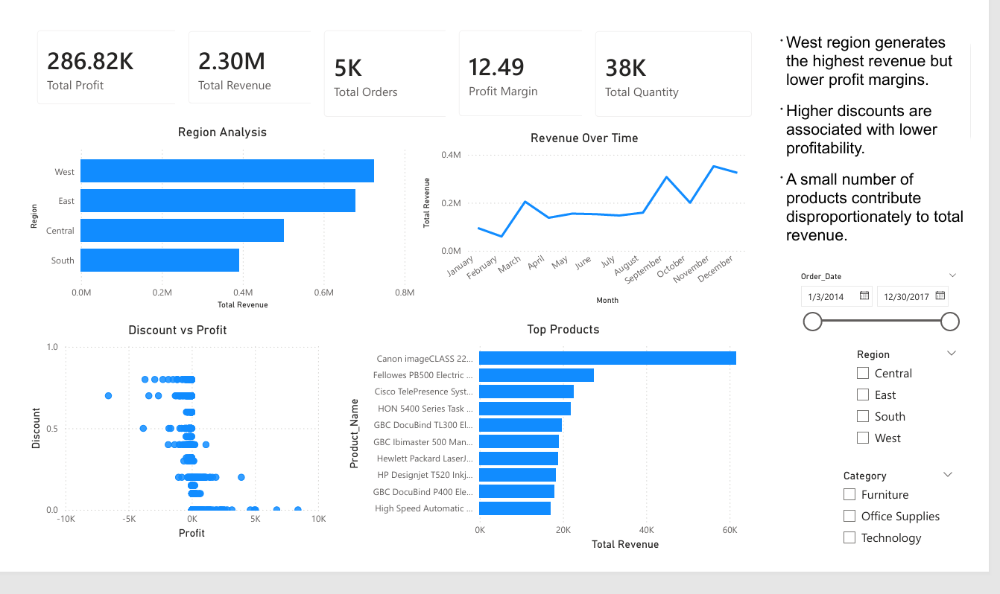

# Sales-Analytics-Dashboard-using-SQL-Server-Power-BI
This project analyzes retail sales performance using SQL Server and Power BI.  The goal is to identify: - Revenue drivers - Most profitable products - Regional sales performance - Impact of discounts on profitability - Products generating high sales but low profit  The dashboard was built using real business KPIs and interactive visualizations.

# Tools Used
- SQL Server Management Studio (SSMS)
- Microsoft Power BI
- SQL
- DAX

# Dataset
Dataset: Superstore Sales Dataset
Source: Kaggle

# Data Cleaning Process
The dataset was cleaned and transformed using SQL Server.
### Key preprocessing steps:
- Handling missing values
- Converting incorrect data types
- Creating calculated fields
- Building SQL analytical queries

# SQL Analysis
Queries :
Example:
SELECT TOP 10
    Product_Name,
    SUM(Sales) AS Revenue
FROM Superstore
GROUP BY Product_Name
ORDER BY Revenue DESC;

# Dashboard Features
The dashboard includes:
- Revenue KPIs
- Profit analysis
- Sales trends over time
- Regional performance
- Top-selling products
- Discount vs Profit analysis
- Interactive filters

# Business Insights 
### Revenue Drivers
The West region generates the highest revenue among all regions.
Technology products contribute significantly to total sales and profitability.

### Most commercial products 
A small group of products contributes disproportionately to total revenue.
The top-selling products generate significantly higher revenue than the rest of the catalog.

### Weak or underperforming areas
The South region shows the lowest revenue performance compared to other regions.
Central region also underperforms compared to West and East regions.

### Does the discount negatively affect the profit?
Higher discounts are associated with lower profitability.
Several high-discount transactions generate very low or even negative profit.

### Products that generate high sales but low profit
Some products generate high sales volume but low profitability, indicating inefficient discounting or high operational costs.

# Business Recommendations
Recommendations:
- Reduce excessive discounting on low-margin products
- Focus marketing efforts on profitable product categories
- Improve sales strategy in underperforming regions
- Monitor products with high revenue but low profit margins

# Dashboard Preview

